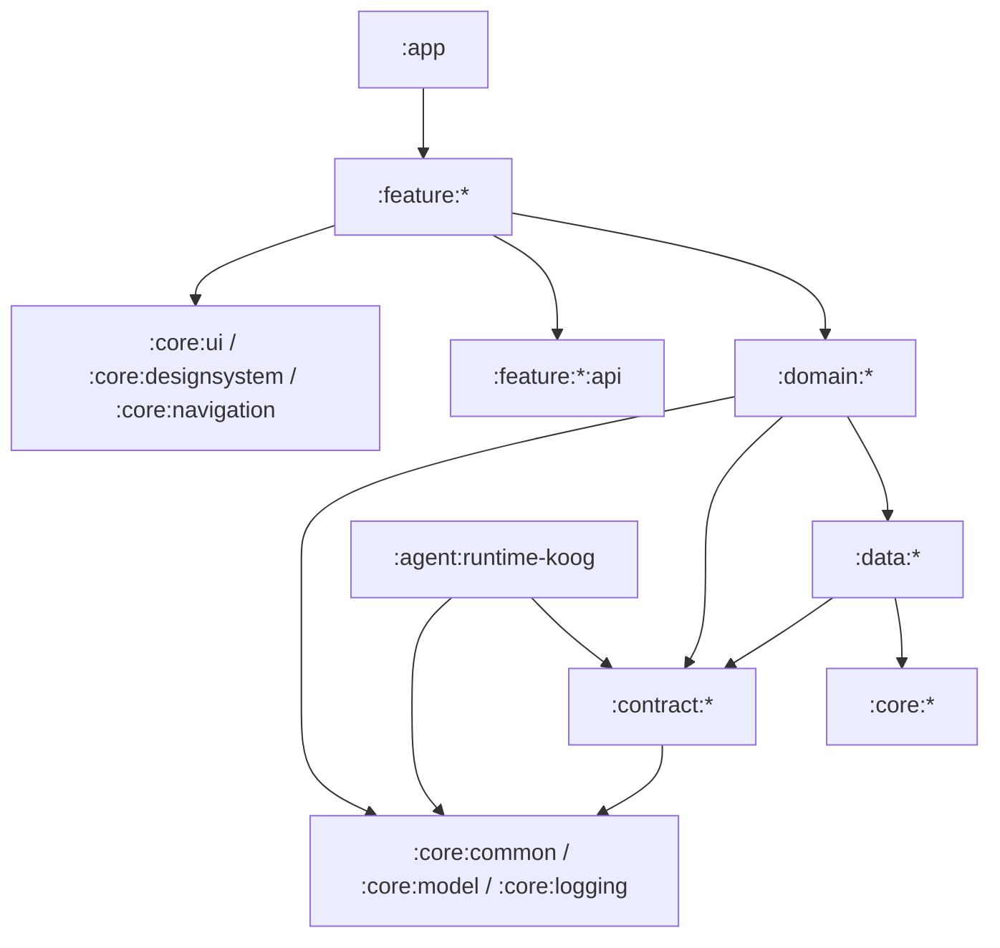

# Android Vibe Design 架构总览

## 文档状态与权威来源

本文是 `new-advd/` 新工程的架构地图，刻意不重复各层的细则。下表中的专项文档是权威来源；若本文与专项文档冲突，以专项文档为准。

| 范围 | 权威文档 |
| --- | --- |
| 数据资源、存储与技术 core | [DATA_AND_STORAGE_ARCHITECTURE.md](DATA_AND_STORAGE_ARCHITECTURE.md) |
| 应用工作流、错误、取消与恢复 | [DOMAIN_ARCHITECTURE.md](DOMAIN_ARCHITECTURE.md) |
| Agent runtime、工具与 SDK 边界 | [AGENT_ARCHITECTURE.md](AGENT_ARCHITECTURE.md) |
| Feature UI、导航、状态、effect 与平台 bridge | [FEATURE_ARCHITECTURE.md](FEATURE_ARCHITECTURE.md) |
| 项目级临时运行资源、关闭与进程死亡恢复 | [PROJECT_RUNTIME_ARCHITECTURE.md](PROJECT_RUNTIME_ARCHITECTURE.md) |

旧的 `android-vibe-design/` 仅是实现历史，不是新工程的架构依据。即使旧实现采用不同方式，新增代码仍必须遵循上述专项文档。

## 目标

- 让贡献者能直接判断代码的 owner 与允许依赖。
- 用 Gradle 强制单向模块依赖，而不是只靠约定或 code review。
- 不让 Android UI、存储、文件、Git、Provider SDK 与 Agent runtime 细节泄露到 feature 与 domain 的公开 API。
- 每个业务资源拥有唯一真相来源及单资源一致性边界。
- 多资源工作流、授权、取消与恢复必须进入命名明确的 domain use case，不能散落在 ViewModel 或 Repository。
- 在出现独立 owner、实现或构建边界收益前，保持模块粗粒度。

项目使用单向数据流：用户 action 向下传递，稳定数据与状态通过 `Flow` 向上传递。

```text
Composable -> ViewModel -> domain use case -> data resource -> core technology
     ^              |                |                |
     +--------------+----------------+----------------+
                immutable state / stable results / Flow
```

## 模块依赖图



依赖图包含以下硬性边界：

1. `:core:*` 不依赖 data、domain、feature、agent、app 或 shell 模块。
2. `:data:*` 只能依赖 core 和获准的 contract；不得依赖 feature、domain、app 或 Agent runtime 实现。
3. `:domain:*` 可以依赖 data 资源契约、`:core:common`、`:core:model`、`:core:logging` 和必要的 `:contract:*`；不得依赖其他 domain、feature、app 或 runtime 实现模块。
4. `:feature:*` 只依赖 domain 与 UI 相关 core；不得依赖 data、存储型技术 core、contract 或 runtime 实现。
5. Feature 不得 import 另一个 feature 的实现；仅在真实跨 feature destination 存在时，才允许薄的 `:feature:<name>:api`。
6. `:app` 是 Android composition root，负责 Application 设置、根导航和安装 feature entry；不放 Screen、ViewModel、Repository 或业务工作流。
7. `:shell` 是独立 APK，不依赖业务 feature。

`verifyModuleGraph` 与 `verifyArchitectureSources` 已接入 `check`。违反这些依赖或源码边界会使构建失败，而不是仅产生 review 建议。

## 当前模块职责

| 分组 | 模块 | 职责 |
| --- | --- | --- |
| App 与构建 | `:app`、`:shell`、`:build-logic:convention` | 组合、APK 入口和共享 Gradle convention。 |
| 共享 core | `:core:common`、`:core:model`、`:core:logging`、`:core:navigation`、`:core:designsystem`、`:core:ui`、`:core:testing` | 稳定基础类型、模型、日志、导航、UI 基础与测试支持。 |
| 技术 core | `:core:database`、`:core:datastore`、`:core:filesystem`、`:core:git`、`:core:secure-storage`、`:core:network` | 仅封装技术适配，不带业务资源语义。 |
| 数据资源 | `:data:workspace`、`:data:template`、`:data:session`、`:data:ai-config`、`:data:settings`、`:data:runtime-log` | 资源契约、默认实现、存储一致性和资源级错误。 |
| Agent 与项目 runtime 契约／引擎 | `:contract:agent`、`:contract:project-runtime`、`:agent:runtime-koog` | SDK 无关的 Agent 工具协议、项目关闭 lifecycle port 及 Koog 实现。 |
| Domain 工作流 | `:domain:workspace`、`:domain:agent`、`:domain:preview`、`:domain:settings` | 跨资源应用操作及业务语义。 |
| UI Feature | `:feature:projects`、`:feature:workbench`、`:feature:templates`、`:feature:versions`、`:feature:settings`、`:feature:build` | 面向用户的流程、页面状态与平台 bridge。 |

初始阶段保持 `:feature:workbench` 完整：Chat、会话抽屉、Preview 与 Console 共享项目上下文且 UI 高内聚。只有它们获得真正独立的 owner、导航边界或发布节奏时才拆分。

## 所有权规则

| 关注点 | Owner | 明确不属于 |
| --- | --- | --- |
| 用户意图、渲染、UI state、Activity Result / WebView bridge | `:feature:*` | Repository、Agent runtime、filesystem、Git、SDK client |
| 命名的应用工作流、授权、顺序与恢复策略 | `:domain:*` | Composable、ViewModel、DAO、SDK adapter |
| 项目文件、会话、模板、配置与 runtime-log 数据 | 对应 `:data:*` | Feature 或其他 data 模块 |
| Room、DataStore、filesystem、Git、Keystore 与 HTTP 机制 | 对应技术 `:core:*` | Domain 业务策略 |
| 模型流式输出与工具调用轮次 | `:agent:runtime-koog` | 项目／会话语义、授权、data gateway 发现 |
| Agent 工具选择、scope、授权、快照与恢复 | `:domain:agent` | Runtime 实现、全局工具注册表、ViewModel |
| Preview server 与 Preview runtime state | `:domain:preview` | WebView、ViewModel、Agent |
| 项目 runtime 的显式关闭与跨资源恢复顺序 | `:domain:workspace` | Feature、data、Agent 或 Preview 内部实现 |

Repository 是普通数据资源的唯一公开入口：它暴露稳定资源模型、观察用 `Flow`，以及带稳定结果／错误语义的 `suspend` 命令。storage entity、DAO、`File`、`Uri`、绝对路径、Android `Context`、Git object 与 SDK 类型不得越过 data 边界。资源专属的 Agent tool factory 是窄例外：只有该资源真正拥有 Agent 工具时才定义，具体规则见 Agent 专项文档。

## API 与状态约定

- Domain 公开 API 只使用稳定 ID、core model、domain request/result/event、`OperationResult`、`AppError` 和 Kotlin coroutine 类型。
- 用户可处理的预期失败使用稳定的 `OperationResult.Failure`；意外技术异常在最近的数据 adapter 分类并脱敏。`CancellationException` 必须重新抛出。
- Feature 将 domain 输出映射为 feature-local、不可变 `UiState`；不得直接渲染 data DTO，也不得在 state 存储 `Throwable`、`Context`、`Uri`、`File`、WebView、Room、Git 或 SDK object。
- `UiEffect` 只表示不可重放的平台行为，例如导航、启动 picker、请求权限、复制文本或短暂 Snackbar。可恢复操作、加载状态与应用真相必须位于 `UiState` 和／或 domain/data state。
- 导航只传 `ProjectId`、`SessionId` 等稳定 route 参数；目标页面通过自己的 domain API 重载数据。
- 所有源码使用英文；用户可见字符串由 owner feature 放入 Android resource 并完成本地化。

## 生命周期与恢复边界

页面状态绑定其 navigation entry。因此，ViewModel 绝不是必须超出 entry 生命周期的资源 owner，例如可恢复操作、项目锁、长运行 Agent turn 或 Preview backend。此类资源必须由明确的 domain/data owner 管理，并拥有持久恢复记录；feature 只观察它们的状态。

注入的 application coroutine scope 只适合在 application process 仍存活时跨页面运行的工作。WorkManager 用于可延迟、可重试、由系统调度的任务。两者都不能单独跨越任意进程终止，因此进程死亡恢复必须依赖持久资源状态与 journal，不能依赖 `onCleared()` 回调。

Workbench 的 Project Runtime 精确策略（Preview backend owner、Agent continuation、lease、显式关闭项目
与进程死亡恢复）见 [PROJECT_RUNTIME_ARCHITECTURE.md](PROJECT_RUNTIME_ARCHITECTURE.md)。它
不得从 Composable、ViewModel 或 Hilt scope 推断。

Project Runtime 不由单一 manager 持有全部状态：`:domain:agent` 和 `:domain:preview` 各自拥有其
独立 runtime；`:domain:workspace` 只通过 `:contract:project-runtime` 的窄 port 执行项目关闭与恢复
编排。具体 API 与顺序见专项文档。

## 交付与评审规则

1. 每次迁移一个完整 vertical slice；不得把旧 app 的 package 结构直接复制到新模块。
2. 新增模块前必须写明职责、允许依赖、公开 API、owner，以及现有模块为何不足。
3. Gradle 默认使用 `implementation`；只有刻意公开签名需要时才使用 `api`。
4. 每个新工作流必须定义幂等 key、资源锁 owner、取消点、持久阶段和恢复入口。
5. 每个新 Agent 工具必须定义资源 owner、schema、授权、输出限制、secret 处理与测试。
6. 模块依赖、公开契约或边界规则变更时，必须在同一变更中更新本文、对应专项文档和架构校验测试。

初始实施顺序是：工作区生命周期与恢复、项目 UI、会话／配置与 Agent 工作流、Workbench UI，最后是模板／版本／设置／构建 feature。每个 vertical slice 在进入下一个前都必须通过 `./gradlew check`。
